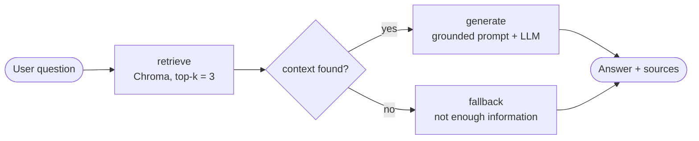
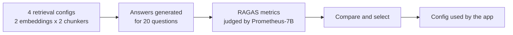

# 👾 TrueRAG

**An evaluation-driven RAG system: the retrieval configuration was chosen by measuring it, not by guessing.**


TrueRAG answers questions over a small corpus of research surveys and always shows **which document and page** the answer came from. Before building the app, I compared four retrieval setups (2 embedding models × 2 chunking strategies) with **RAGAS**, and the app runs on the winner.

<!-- Add a screenshot or GIF of the app here, e.g.  -->

---

## Table of Contents

- [Features](#features)
- [How It Works](#how-it-works)
- [Evaluation](#evaluation)
- [Tech Stack](#tech-stack)
- [Project Structure](#project-structure)
- [Getting Started](#getting-started)
- [Project Phases](#project-phases)
- [Engineering Challenges & Decisions](#engineering-challenges--decisions)
- [Limitations & Future Work](#limitations--future-work)

---

## Features

- **Grounded answers.** The LLM is instructed to answer only from the retrieved context and to say so when the context does not contain the answer.
- **Source citations.** Every answer lists the source PDF, page number, and a link to the document.
- **LangGraph workflow.** Retrieval, generation, and a fallback path are explicit graph nodes.
- **Measured configuration.** The embedding model and chunking strategy come from a RAGAS comparison, documented in the notebooks.
- **Streamlit UI.** A chat tab for questions and an evaluation tab for the experiment results.

## How It Works

The knowledge base is three survey papers (127 pages in total): a survey of Transformers, a survey of Large Language Models, and a survey on evaluating LLMs.



**Indexing** (`scripts/build_vector_db.py`): PDFs are loaded with `PyPDFLoader`, split with `RecursiveCharacterTextSplitter` (`chunk_size=1000`, `chunk_overlap=200`, 603 chunks), embedded with `all-MiniLM-L6-v2`, and stored in a persistent Chroma collection (`emb_a_recursive`).

**Query time** (`src/rag/`): the retrieval node fetches the top 3 chunks and collects source metadata (file, page, URL). If context exists, the generation node answers from it; otherwise the fallback node returns a "not enough information" response.

## Evaluation

The project is built around one question: *which retrieval setup is actually better?* Four configurations were compared on the same 20 questions.



| Setting | Value |
|---|---|
| Embedding models | `all-MiniLM-L6-v2` (**A**) · `BAAI/bge-base-en-v1.5` (**B**) |
| Chunking | Recursive (1000 / 200, 603 chunks) · Semantic (413 chunks) |
| Eval questions | 20, picked by fixed IDs from a curated QA set (`rag_eval_qa_dataset.csv`) with ground-truth answers, difficulty, and question type |
| Metrics | Faithfulness, Answer Relevancy, Context Precision, Context Recall |
| Framework | RAGAS 0.4.3 |
| Evaluator LLM | Prometheus-7B-v2.0 (Q4_K_M GGUF), served through an OpenAI-compatible API |
| Embeddings for Answer Relevancy | `bge-base-en-v1.5`, kept fixed across all experiments |

### Results

Mean score over 20 questions:

| Configuration | Embedding | Chunking | Faithfulness | Answer Relevancy | Context Precision | Context Recall |
|---|---|---|---:|---:|---:|---:|
| `emb_a_semantic` | MiniLM | Semantic | 0.362 | 0.624 | 0.621 | 0.600 |
| `emb_b_semantic` | BGE | Semantic | 0.325 | 0.634 | 0.700 | 0.600 |
| **`emb_a_recursive`** ✅ | **MiniLM** | **Recursive** | **0.400** | **0.751** | **0.742** | **0.700** |
| `emb_b_recursive` † | BGE | Recursive | 0.275 | 0.757 | 0.808 | 0.700 |

† **Not fully measured.** The Colab GPU quota ran out before this configuration finished, so some of its values are estimates. They are kept in the table for transparency and are stored separately from measured scores in the results file. This row is not used to choose the final configuration.

**Selected: `emb_a_recursive`** (MiniLM + recursive chunking). Among the fully measured configurations it scored highest on all four metrics.

What the numbers show:

- For MiniLM, recursive chunking beat semantic chunking on every metric (for example Answer Relevancy 0.751 vs 0.624).
- The two semantic configurations are close to each other; BGE helped Context Precision (0.700 vs 0.621) but not Faithfulness.
- These are relative comparisons from a quantized 7B judge on 20 questions. Read them as a ranking of configurations, not as absolute quality scores.

## Tech Stack

| Layer | Choice |
|---|---|
| Orchestration | LangGraph, LangChain |
| Vector store | ChromaDB (persistent, included in the repo) |
| Embeddings | `sentence-transformers/all-MiniLM-L6-v2` via Hugging Face Inference API |
| Generation (app) | `openai/gpt-oss-safeguard-20b` via Groq |
| Generation (experiments) | Qwen3 4B (`qwen3:4b-q4_K_M`) running locally through Ollama |
| Evaluation | RAGAS 0.4.3 with Prometheus-7B-v2.0 as the judge |
| UI | Streamlit |
| Experiment compute | Google Colab (Tesla T4) |

## Project Structure

```text
TrueRAG/
├── app.py                    # Streamlit UI (Chat + Evaluation)
├── src/
│   ├── config.py             # model names, top-k, vector DB path, PDF links
│   ├── embeddings.py         # Hugging Face embedding client
│   ├── llm.py                # Groq chat model
│   ├── retriever.py          # Chroma retriever
│   └── rag/
│       ├── graph.py          # LangGraph workflow
│       ├── nodes.py          # retrieve / generate / check_context / fallback
│       └── prompts.py        # grounded answer prompt
├── scripts/
│   └── build_vector_db.py    # builds the Chroma index from the PDFs
├── tests/                    # smoke-test scripts for retriever, LLM, and graph
├── notebooks/
│   ├── main_clean.ipynb              # Phases 1-3: basic RAG, LangGraph, RAGAS setup
│   ├── ragas_colab_clean.ipynb       # Colab RAGAS runs and final comparison
│   ├── main.ipynb                    # full working notebook (raw history)
│   └── ragas_evaluation_driven_project.ipynb  # full Colab working notebook (raw history)
├── data/                     # source PDFs and the evaluation QA set
├── vector_db/                # persisted Chroma index (collection: emb_a_recursive)
├── pyproject.toml
└── requirements.txt
```

## Getting Started

**Prerequisites:** Python 3.10+, a [Hugging Face](https://huggingface.co/settings/tokens) token, and a [Groq](https://console.groq.com/keys) API key.

```bash
# 1. Clone and enter the project
git clone https://github.com/krishn-2005/TrueRAG.git
cd TrueRAG

# 2. Create a virtual environment
python -m venv venv
source venv/bin/activate        # Windows: venv\Scripts\activate

# 3. Install dependencies and the project package
pip install -r requirements.txt
pip install -e .

# 4. Add your keys
cat > .env << 'EOF'
HUGGINGFACEHUB_API_TOKEN=your_hf_token
GROQ_API_KEY=your_groq_key
EOF

# 5. Run the app
streamlit run app.py
```

The repository already includes a built `vector_db/`, so step 5 works without re-indexing.

**Rebuilding the index** (only if you change the chunking or embedding settings). The source PDFs must be in `data/`:

```bash
python -m scripts.build_vector_db
```

**Smoke tests:**

```bash
python -m tests.test_retriever
python -m tests.test_llm
python -m tests.test_graph
```

## Project Phases

| Phase | What was done | Where |
|---|---|---|
| 1. Basic RAG | PDF loading, recursive chunking, embeddings, Chroma, retriever, grounded prompt | `main_clean.ipynb` |
| 2. LangGraph upgrade | Retrieve → context check → generate / fallback as graph nodes | `main_clean.ipynb`, `src/rag/` |
| 3. RAGAS setup | Evaluation dataset, four metrics, Prometheus evaluator | `main_clean.ipynb` |
| 4. Retrieval experiments | 2 embeddings × 2 chunkers compared on 20 questions, best config selected | `ragas_colab_clean.ipynb` |
| 5. Reranker evaluation | Deferred to future work (see below) | — |

## Engineering Challenges & Decisions

The project initially used hosted LLM inference, but API usage and evaluation cost/limits became restrictive as the number of RAGAS evaluation calls increased. We then moved to local LLM inference, which introduced hardware, CUDA, and dependency challenges on the available GTX 1650.

To make large-scale evaluation practical, the evaluator was moved to Google Colab. This improved compute capacity but introduced runtime and GPU usage constraints, so checkpointing was added to avoid losing evaluation progress.

After completing the core retrieval experiments, reranker evaluation was deferred because it would require another model stack and significant additional compute.

### Key Takeaways

- **Model selection involves both quality and compute requirements.**
- **Evaluation workloads can be significantly more expensive than normal inference.**
- **Checkpointing is useful for long-running experiments on temporary environments.**
- **Resource constraints should influence experimental scope and system design.**

## Limitations & Future Work

- **Reranker evaluation was deferred due to computational constraints and is planned as future work.**
- The evaluation set is 20 questions. A larger set would make the comparison between close configurations more reliable.
- `emb_b_recursive` has estimated values and would need a full re-run to be compared on equal terms.
- The evaluator is a quantized 7B model, so absolute scores (especially Faithfulness) should be treated as relative signals.
- The corpus is limited to three survey papers.